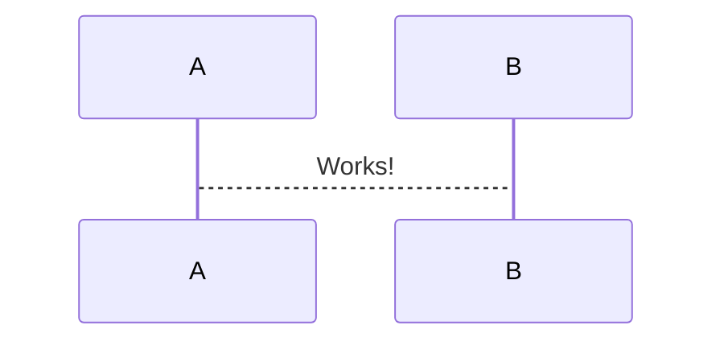

# Mermaid Preview

Mermaid diagram previewer for Visual Studio Code.

[](https://marketplace.visualstudio.com/items?itemName=vstirbu.vscode-mermaid-preview)
[](https://marketplace.visualstudio.com/items?itemName=vstirbu.vscode-mermaid-preview)
[](https://marketplace.visualstudio.com/items?itemName=vstirbu.vscode-mermaid-preview)

## Usage

0. Open a file containing Mermaid diagram
0. Choose `Preview Mermaid Diagram`
0. Move cursor inside the diagram


## Supported formats

The plugin detects mermaid diagrams in the following formats:

### HTML tag

```html
<div class="mermaid">
sequenceDiagram
  A-->B: Works!
</div>
```

### Markdown fenced code

<pre>

</pre>

## Customize diagrams

You can customize the appearence of the previewed diagrams by setting the mermaid configuration in the workspace settings:

```json
{
  "mermaid": {
    "sequenceDiagram": {
      "mirrorActors": false
    }
  }
}
```

All mermaid configuration [options](http://knsv.github.io/mermaid/#mermaidapi) are supported. 