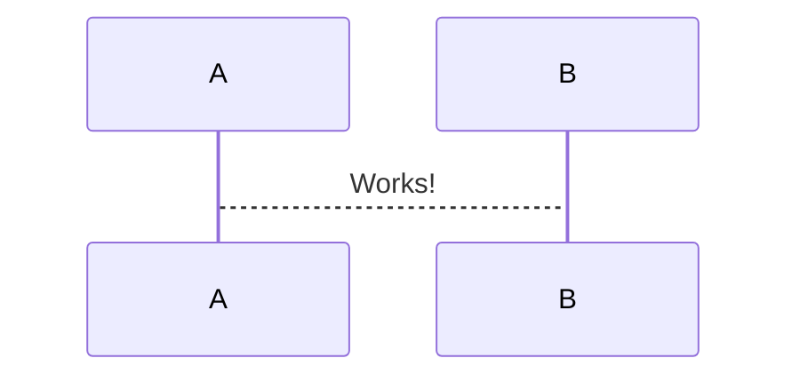

# Mermaid diagram previewer for Visual Studio Code

[](https://marketplace.visualstudio.com/items?itemName=vstirbu.vscode-mermaid-preview)
[](https://marketplace.visualstudio.com/items?itemName=vstirbu.vscode-mermaid-preview)
[](https://marketplace.visualstudio.com/items?itemName=vstirbu.vscode-mermaid-preview)
[](https://marketplace.visualstudio.com/items?itemName=vstirbu.vscode-mermaid-preview)

[](https://travis-ci.org/vstirbu/vscode-mermaid-preview)
[](https://greenkeeper.io/)

[](https://www.paypal.com/cgi-bin/webscr?cmd=_s-xclick&hosted_button_id=XUTSVST4DNTFC)

The plugin enables live editing and visualization of [mermaid](https://mermaidjs.github.io) supported diagrams.

Related plugins:

- [syntax highlighting](https://github.com/bpruitt-goddard/vscode-mermaid-syntax-highlight)

## Usage

0. Open a file containing Mermaid diagram
1. Choose `Preview Mermaid Diagram`
1. Move cursor inside the diagram


## Supported formats

The plugin detects mermaid diagrams in the following formats:

### HTML tag

```html
<div class="mermaid">
  sequenceDiagram A-->B: Works!
</div>
```

### Markdown fenced code

<pre>

</pre>

### HUGO shortcodes

```html
 sequenceDiagram A-->B: Works! 
```

### Sphinx directives

```html
.. mermaid:: :parameters: are optional sequenceDiagram A-->B: Works!
```

The plugin does not preview diagrams in external files:

```html
.. mermaid:: graphs/mygraph.mmd
```

### Standalone Mermaid files

Files with extension `.mmd` with plain Mermaid diagram content:

```
sequenceDiagram
  A-->B: Works!
```

## Customize diagrams

### Rendering

You can customize the appearence of the previewed diagrams by setting the mermaid configuration in the workspace settings:

```json
{
  "mermaid": {
    "sequenceDiagram": {
      "mirrorActors": false
    }
  }
}
```

All mermaid configuration [options](http://knsv.github.io/mermaid/#mermaidapi) are supported.

### Custom theme

You can render the diagram using a custom theme by providing the following configuration properties:

```json
{
  "mermaid": {
    "theme": null,
    "themeCSS": "the theme as string"
  }
}
```

:warning: The value `null` for `theme` disables the automatic theme detection, so you are responsible for providing a proper theme in `themeCSS` for all diagrams used in the settings' scope.
