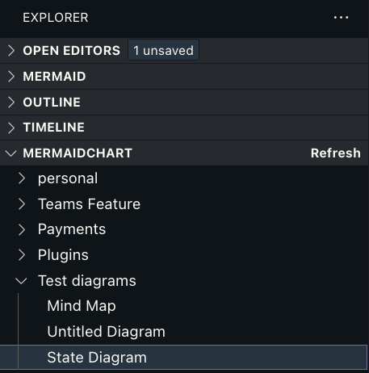
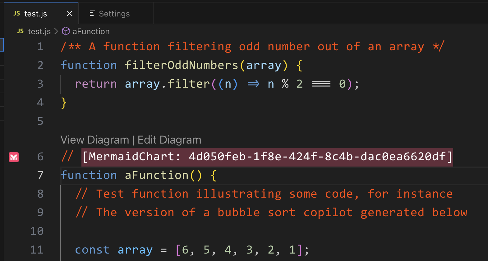
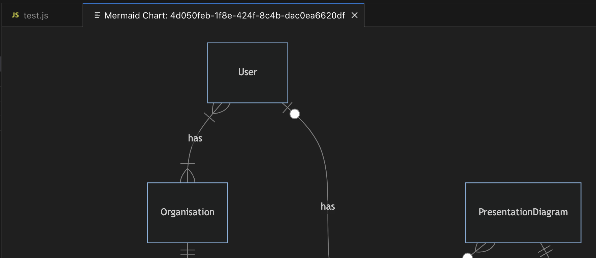
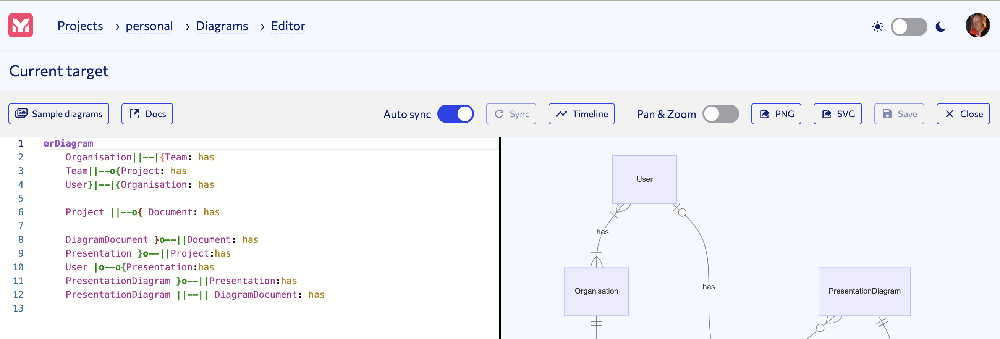

# Mermaid Chart extension for Visual Studio Code

This extension is a Tool for visualizing and editing Mermaid diagrams in Visual Studio Code.The extension enables developers to view and edit diagrams stored in Mermaid Chart from Visual Studio Code. With the integration to the Mermaid Chart service, this extension allows users to attach diagrams to their code and to gain quick access to updating diagrams.

Simplify your development workflow with the Mermaid Chart extension.

## Features

In the explorer view under the MERMAIDCHART section you will find all the diagrams you have access to. When you click on a diagram, that diagram will be inserted into the code editor at the position of the cursor. To get the latest changes of diagrams from Mermaid Chart, click on the button named Refresh in the explorer view.

You can attach diagrams into your code. The attachments are highlighted with an icon in the footer.

You have two links associated with he diagram, one for viewing the diagram in a new tab in Visual Studio Code and one that opens the diagram for editing at Mermaid Chart. This way it is easy to consume the diagram as well as updating it if some detail needs to be corrected.

The following image show how a new tab is opened with the diagram after clicking on the view diagram link:

The other link opens the diagram for editing in a browser window.

## Requirements

The Mermaid Chart extension for Visual Studio Code seamlessly integrates with the Mermaid Chart service, requiring an account to use. Choose between the free tier (limited to 5 diagrams) or the pro tier (unlimited diagrams). Collaborate by setting up teams and sharing diagrams within your development organisation. Simplify diagram management and enhance your workflow with Mermaid Chart for Visual Studio Code.

## Extension Settings

This extension contributes the following settings:

- `mermaidChart.baseUrl`: This points to the instance of mermaid chart you are running, for the public service this is `https://www.mermaidchart.com/`.
- `mermaid.vscode.dark`: Defines the theme used for Mermaid diagrams when VS Code is in dark mode.
- `mermaid.vscode.light`: Defines the theme used for Mermaid diagrams when VS Code is in light mode.
By setting these options in your VS Code settings, you can customize the appearance of Mermaid diagrams to match your preferred theme.

## Release Notes

### 1.0.3 - 2023-07-17

- Added OAuth support for the MermaidChart plugin.

### 1.0.2 - 2023-07-14

- Added support for multiple languages including python, markdown, yaml, etc.

### 1.0.1 - 2023-06-29

- Added default value "https://www.mermaidchart.com" for baseUrl configuration setting.
- Corrected inserted label in editor code.
- Added info in README.md about the MERMAIDCHART field in the explorer view.

### 1.0.0 - 2023-06-26

- Initial release of the Mermaid Chart extension for Visual Studio Code.
