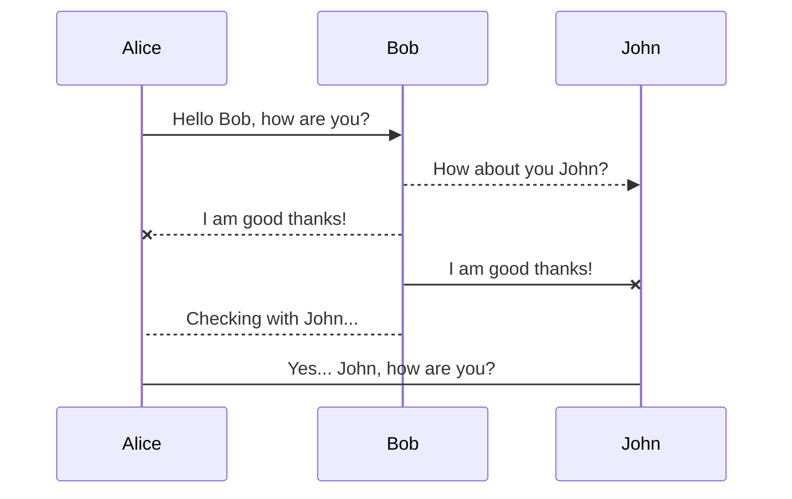
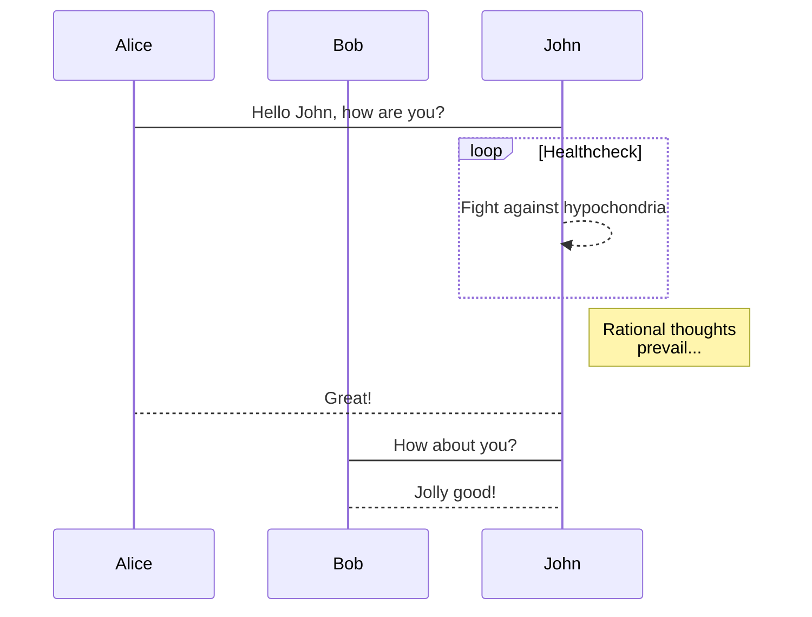

```mermaid
sequenceDiagram
    Alice ->> Bob: Hello Bob, how are you?
    Bob-->>John: How about you John?
    Bob--x Alice: I am good thanks!
    Bob-x John: I am good thanks!

    Bob-->Alice: Checking with John...
    Alice->John: Yes... John, how are you?
```

```mermaid
sequenceDiagram
    participant Alice
    participant Bob
    Alice->John: Hello John, how are you?
    loop Healthcheck
        John-->>John: Fight against hypochondria
    end
    Note right of John: Rational thoughts <br/>prevail...
    John-->Alice: Great!
    John->Bob: How about you?


    Bob-->John: Jolly good!
```
